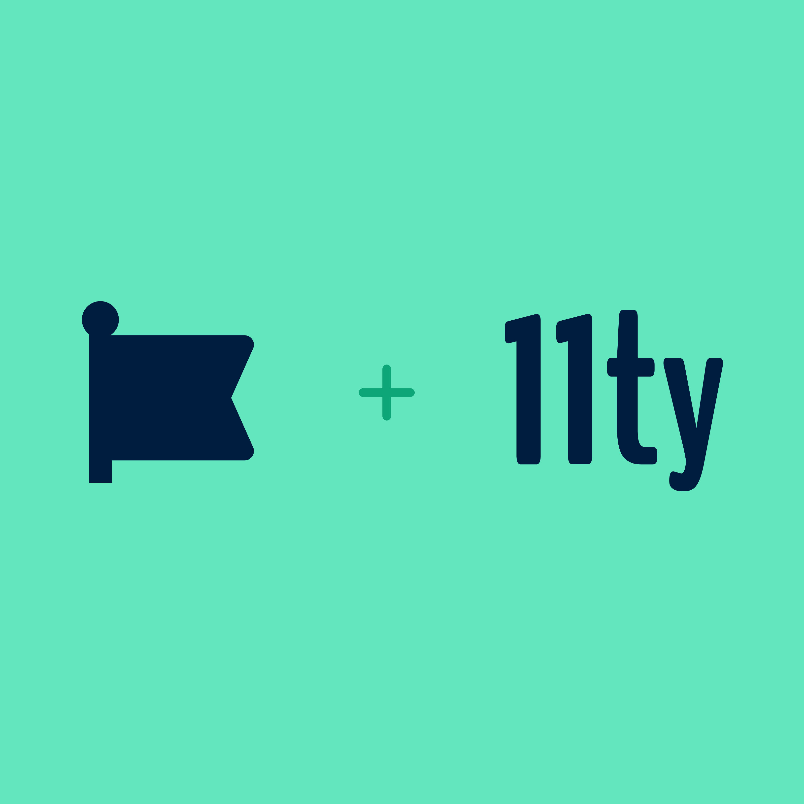

Today—I’m delighted to announce that 11ty is joining the excellent team at [_Font Awesome_](https://fontawesome.com/).

You’re probably already familiar with the folks at Font Awesome.

* Maybe you’ve used their excellent open source [icon library](https://fontawesome.com/icons).
* Perhaps you’ve used the newly minted open source web components library [Web Awesome](https://blog.fontawesome.com/introducing-web-awesome/) (a.k.a. Shoelace).
* But surely you remember one of the [legendary promo videos from their wildly successful Kickstarter campaigns](https://www.youtube.com/playlist?list=PLd3CSqexVW6fZv3VTnquaZPmY1XOC9A9h).

_Read more on [Blog Awesome: Eleventy joins Font Awesome](https://blog.fontawesome.com/eleventy-joins-font-awesome/)._

## What does this mean for Eleventy?

No action is required by folks using and building with Eleventy. We will continue to help you build fast web sites (with fast build times!) and we will continue to develop and maintain the open source project as before!

We’ve had a lot of great discussions about best practices for sustainable open source with the Font Awesome folks in the past few months and they have a well established record of maintaining open source projects—as evidenced by the [path already paved by Cory Laviska with Shoelace and Web Awesome](https://www.abeautifulsite.net/posts/the-future-of-shoelace/) (October 2022).

We’re excited that Eleventy is going to play a deeper role in the _Awesome ecosystem_ and believe that this partnership will extend the life expectancy of the project well beyond our original ten-year goal!

## What’s Next?

Eleventy recently [shipped our first 3.0 beta release](/blog/three-point-oh-beta-one/) and the stable release is currently classified as _imminently_ shippable—stay tuned for that very soon!

I’m happy to answer any questions you might have (about this news or anything else about Eleventy)—just send me a message on [Mastodon](https://fosstodon.org/@eleventy)!