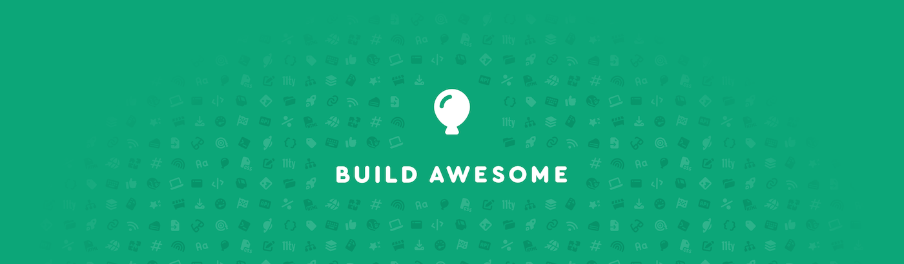

**It’s one small step for 11ty, one giant leap for Build Awesome.**

When [11ty joined Font Awesome in September 2024](/blog/eleventy-font-awesome/), it was hot on the heels of the successful [Web Awesome](https://webawesome.com/) Kickstarter, notably upgrading the Shoelace project from a bootstrapped side project to a sustainable and thriving full-time open source project with employees supporting its maintenance, new feature development, and future.

We are following the same playbook for Eleventy! To support us, subscribe to the upcoming [Build_Awesome_Kickstarter_final_Final_v2.psd]({{ config.kickstarterUrl }}) and get notified when the campaign launches!

_Folks following along closely may have noticed the [_oopsie-daisy_ false-start fundraising campaign](https://blog.fontawesome.com/pausing-kickstarter/) earlier this week. Given a few email deliverability hiccups, folks not following along closely may [not know](https://blog.fontawesome.com/we-have-a-99-email-reputation-gmail-disagrees/) about the campaign at all! We are taking a mulligan._

<a href="{{ config.kickstarterUrl }}" class="announcement-btn">Subscribe to the Build Awesome Kickstarter</a>

## What does Build Awesome mean for Eleventy?

First and foremost, it’s very important to recognize how instrumental Font Awesome has been to the progress the Eleventy project has made in the last 18 months — and you can review a lot of those in the [Eleventy, 2025 in Review](/blog/review-2025/) highlights!

Secondly, the name change is _not_ a clean break for Eleventy — this is a continuation of the open source project under the larger Awesome banner. Eleventy v4 will be Build Awesome v4. I, [Zach](https://zachleat.com/), am still lovingly shepherding the open source project forward, the same as before.

If you have a project _using_ Eleventy, I can promise the same obsessive attention to smooth major-version upgrades. Folks have come to expect this from Eleventy, and I’m proud of the reputation we’ve earned there. We’ll continue to guide folks using the [Upgrade Helper plugin](/docs/plugins/upgrade-help/).

Notably, **we are committed to keeping full compatibility with the existing Eleventy community and ecosystem**: that means you will be able to continue to use Eleventy plugins with Build Awesome!

Further, we will even maintain compatibility with your existing Eleventy build commands. The proof will be in the pudding, and I look forward to delighting folks here.

## What does Build Awesome Pro mean for Eleventy?

After the launch of Font Awesome Pro, the number of free icons in the Font Awesome library _tripled_, and the full set grew from 675 icons to just over 64,000 icons!

After the launch of Web Awesome Pro, the project has now shipped with over 50 components, 30 reusable patterns, and a whole slew of themes with light and dark modes!

Build Awesome Pro means that we can continue to grow and invest in the open source project, providing more features, more maintenance, and increased stability for _everyone_.

Font Awesome Pro is not required to use Font Awesome. Web Awesome Pro is not required to use Web Awesome. And Build Awesome Pro will not be required to use Build Awesome (Eleventy).

The Awesomeverse of projects have a straightforward business model and Font Awesome has the track record to prove it. You subscribe and you get more: more services, more support — all while helping to grow the free and open source version for everyone. No shenanigans.

## What does this mean for the Open Collective account?

For a bit of history, you can read about our Open Collective fundraising push in early 2024 in the blog post: [_Open Source Needs to be Financially Symbiotic_](https://www.zachleat.com/web/symbiotic-open-source/), which has some notes about our current Open Collective account. We also made a change last year to [permanently feature individuals that have contributed to Eleventy](https://www.zachleat.com/web/permanent-eleventy-facepile/) over the years in our site’s (very large) backer facepile.

This account is still being used to pay for expenses related to the project: costs related to our web site, expenses for the Meetup (Zoom subscriptions), honorariums and other costs from the 11ty Conference (in 2024), as well as some recurring donations to some dependencies in our stack. If you have eligible expenses, please use the [Submit Expense button on Open Collective](https://opencollective.com/11ty) to get reimbursed!

This also includes hosting and domain costs for community resources! Even if they’re old expenses, please get those receipts in so we can reimburse you.

But importantly, moving forward — the best way to support the project moving forward will be through the [Kickstarter campaign]({{ config.kickstarterUrl }}).

<a href="{{ config.kickstarterUrl }}" class="announcement-btn">Subscribe to the Build Awesome Kickstarter</a>

If folks have questions about any of this, please send them my way! My DMs are open on [Mastodon](https://neighborhood.11ty.dev/@11ty) and [Bluesky](https://bsky.app/profile/11ty.dev).

---

- Related: [Podcast Awesome: Eleventy is Rebranding to Build Awesome: What Changes (and What Doesn’t)](https://www.podcastawesome.com/2092855/episodes/18785266-eleventy-is-rebranding-to-build-awesome-what-changes-and-what-doesn-t)